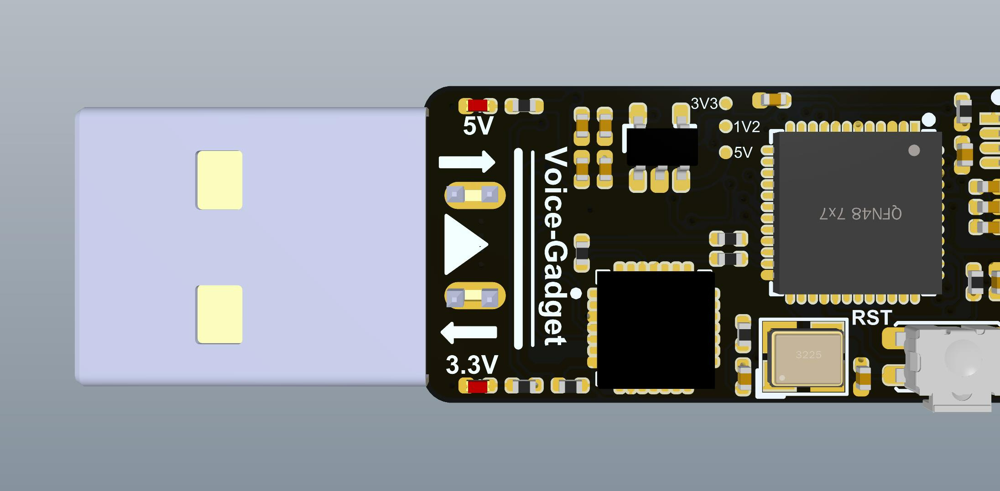
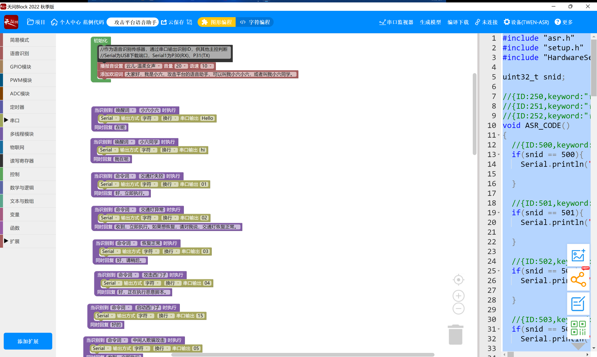

# 攻击平台语音交互插件 - VoiceGadget

## 0  前言

> 语音交互是一种极其“优雅”的人机交互方式。人机交互是人与机器之间进行互动，沟通，信息交换的学问。经过几十年的发展，我们从DOS操作系统到施乐的图形化界面到移动设备的触控交互再到如今的自然语言、AR、VR、MR交互，人与机器之间的交互方式在不断的更新和优化。如果硬要划分阶段的话，我们可以给人机交互划分为以下几个阶段：

> CLI(Command-line interface)命令行界面：这种交互方式是由打字机演化而来，用户输入命令，电脑执行操作。命令都是代码形式的，因此用户必须熟记指令才能操作。大家目前所熟悉的DOS窗口或者Linux命令行模式都是这种指令交互方式。

> GUI(Graphic user interface)图形用户界面：图形化展示，由鼠标操作电脑。与CLI相比，GUI大幅度降低了新用户的学习成本，并且具备所见即所得的特征，用户通过“窗口”、“按钮”、“图标”、“菜单”这些隐喻的组件能非常方便地完成于计算机的沟通。

> NUI(Natual user interface)自然用户界面：用户可使用人类自然的方式，比如语音、面部表情、手势、乃至目前最新的脑机接口等。

## 1  使用方式

### 1.1  固件开发

开发软件采用天问Block，软件下载可自行百度，非常简单。

固件开发非常简单，小孩子都会的拖拽编程，低代码目前来说也是一种趋势，工程师们为了把更多的精力放在业务需求上，想近了各种办法来降低编码难度，大家也可以看到python相比较于C++，go相比较于python就知道了。



### 1.2  固件烧录


连接主机


### 1.3  固件测试


### 1.4 上位机代码

上位机核心代码如下

```python
import serial
import time

serialport = serial.Serial()

class SerialConfig(object):
import serial
import time

serialport = serial.Serial()

class SerialConfig(object):
    def SerialInit(self, comPort, baudRate, byteSize, stopFlag, timeout):
        serialport.port = str(comPort)
        serialport.baudrate = baudRate
        serialport.bytesize = byteSize
        serialport.parity = serial.PARITY_NONE
        serialport.stopbits = stopFlag
        serialport.timeout = timeout
        serialport.close()
        if not serialport.isOpen():
            serialport.open()

if __name__ == "__main__":
    serialconfig = SerialConfig()
    serialconfig.SerialInit('/dev/ttyUSB0', 9600, 8, 1, 0.05)
    while(1):
        time.sleep(0.05)
        num = serialport.inWaiting()
        if num > 0:
            data = serialport.read(num)
            order = data[0:2]
            print(order)
```

上位机根据从VG（Voice-Gadget）拿到的数据执行不同的指令，实现语音交互。